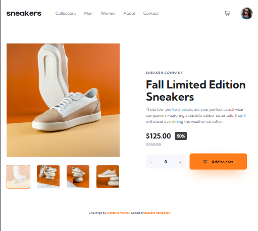
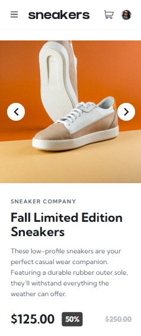
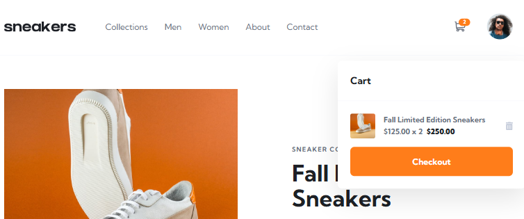

# Frontend Mentor - E-commerce Product Page Solution

This is a solution to the E-commerce product page challenge on Frontend Mentor. This project focuses on building a responsive, interactive product page with a functional cart and image gallery [ecommerce challenge](https://www.frontendmentor.io/challenges/ecommerce-product-page-UPsZ9MJp6).

## Table of contents

- [Overview](#overview)
  - [The challenge](#the-challenge)
  - [Screenshot](#screenshot)
  - [Links](#links)
- [My process](#my-process)
  - [Built with](#built-with)
  - [What I learned](#what-i-learned)
- [Author](#author)

## Overview

### The challenge

Users should be able to:

- View the optimal layout for the site depending on their device's screen size.
- See hover states for all interactive elements on the page
- Open a fullscreen lightbox gallery by clicking on the large product image.
- Switch between viewing Daily, Weekly, and Monthly stats
- Add items to the cart.
- View the cart and remove items from it.

### Screenshot

|        Desktop Version         |        Mobile Version                      |         Lightbox States                    |        Cart                    |
| :----------------------------: | :---------------------------:              | :---------------------------:              |:----------------------------:  |
|  |  |     | |

### Links

- Solution URL: [Solution url](https://github.com/BaskoroR725/11-time-tracking-js-fetch.git)
- Live Site URL: [Live site](https://baskoror725.github.io/11-time-tracking-js-fetch/)

## My process

### Built with

- Semantic HTML5 markup
- CSS custom properties
- Flexbox
- CSS Grid
- SASS/SCSS
- Mobile-first workflow
- Vanilla JavaScript

### What I learned

During this project, I strengthened my skills in managing complex layouts and UI states. Key takeaways include:

1. **Sass Architecture:** Implementing a modular folder structure (abstracts, components, layout) to keep styles maintainable.

2. **Advanced CSS Transitions:** Creating smooth mobile navigation drawer effects without layout thrashing by utilizing transform and opacity instead of display properties.

3. **Lightbox Implementation:** Building a custom accessible modal from scratch for the desktop gallery view

```javascript
const handleAddToCart = (quantity: number) => {
  if (quantity > 0) {
    setCartItems(prev => prev + quantity);
  }
};
```

## Author

- Baskoro Ramadhan
